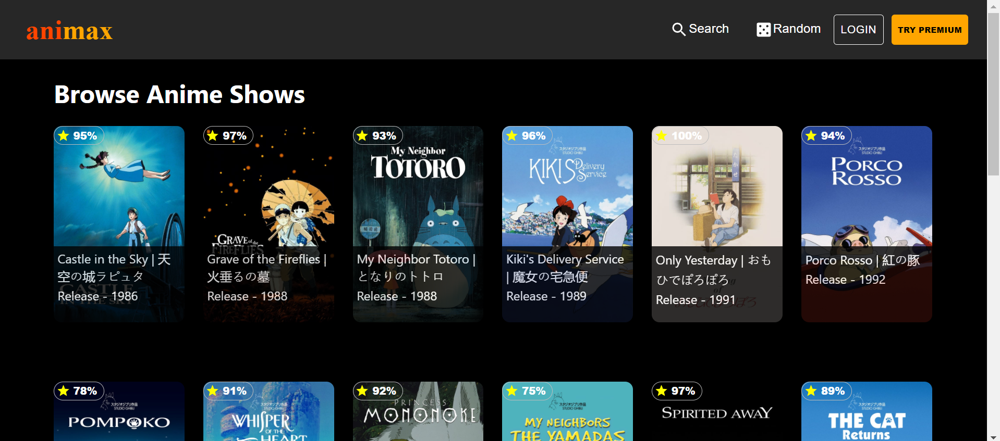
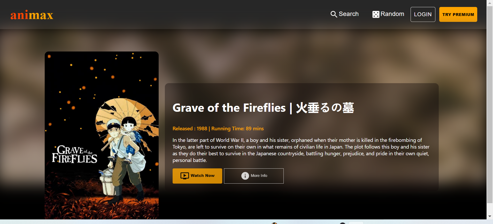
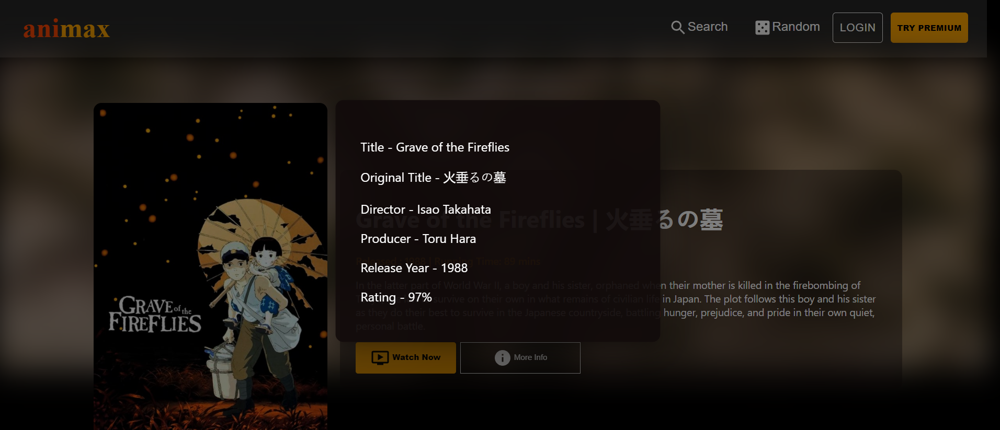

Animax is an application which shows number of Animes fetching data from a heroku hosted API .
Created this App as part of Learning , Used ReactJS as major technology . Also tried Using MUI as React UI Library . 

Here are some screenshots from the application created :

Checkout the Application here : https://animax-anime.herokuapp.com/